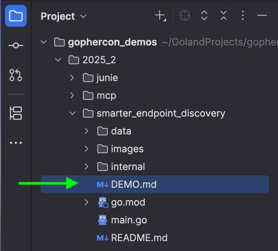

# Awesome GoLand

> /* A curated guide to the best tips and tricks for mastering GoLand. */

### Where to Start?

This repository includes demonstration materials for Go-related conferences.

Each module has its own `DEMO.md` file, kindly refer to that. 

