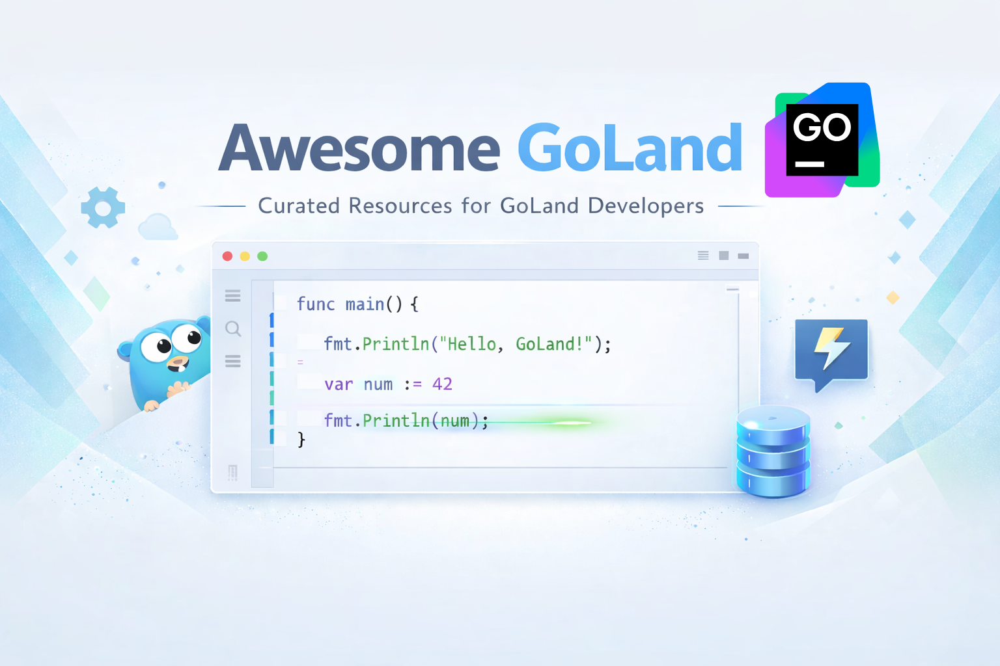

# Awesome GoLand

[](https://github.com/sindresorhus/awesome#readme)
[](https://go.dev/)
[](https://www.jetbrains.com/go/)

> A curated guide to the best tips and tricks for mastering GoLand.



## Why Awesome GoLand?

Whether you're new to GoLand or a seasoned user, this repository helps you unlock the IDE's full potential:

- 🐛 **Debug Like a Pro** — Master goroutine labeling, smart step-into, and core dumps
- 🧪 **Automate Testing** — Generate and run tests with minimal effort
- 🔄 **JSON ↔ Struct** — Convert JSON to Go structs in seconds
- 🐳 **Cloud-Native Ready** — Docker and Kubernetes workflows out of the box
- ⚡ **Performance Insights** — CPU, memory, and block profiling made simple
- 🤖 **AI-Powered Coding** — Explore Junie and MCP for smarter development
- 🔍 **Structural Refactoring** — Pattern-based search and replace across your codebase

> 💡 Each module includes hands-on demos — learn by doing, not just reading.


---

## Table of Contents
- [Prerequisites](#prerequisites)
- [Quick Start](#quick-start)
- [Featured Modules](#featured-modules)
  - [Core Development](#core-development)
  - [API & Microservices](#api--microservices)
  - [Docker & Kubernetes](#docker--kubernetes)
  - [Profiling & Performance](#profiling--performance)
  - [AI & Extensibility](#ai--extensibility)
- [How to Use](#how-to-use)
- [Contributing](#contributing)


---

## Prerequisites

Before you begin, ensure you have the following installed:
- [Go 1.25+](https://go.dev/dl/)
- [GoLand IDE](https://www.jetbrains.com/go/download/) (Latest version recommended)
- [Docker](https://www.docker.com/get-started) (Required for Docker and Kubernetes modules)
- [Kubernetes / kubectl](https://kubernetes.io/docs/tasks/tools/) (Required for Kubernetes modules)

## Quick Start

1. **Clone the repository:**
   ```bash
   git clone https://github.com/mukulmantosh/awesome-goland.git
   cd awesome-goland
   ```
2. **Open in GoLand:**
   - Launch GoLand.
   - Click `Open` and select the `awesome-goland` directory.
3. **Download dependencies:**
   - GoLand will automatically detect `go.mod` files and prompt you to download dependencies.
   - Alternatively, run: `go mod download` in the root (though many modules have their own `go.mod`).

## Featured Modules

Each module is designed to demonstrate specific GoLand capabilities. Look for `DEMO.md` or `README.md` in each directory for detailed walkthroughs.

### Core Development
- **[Debugging](./features/debugging)**: Master the debugger with [Smart Step Into](./features/debugging/smart_step), [Goroutine Labeling](./features/debugging/label_goroutines), and [Core Dumps](./features/debugging/dump_goroutines).
- **[Testing](./features/testing/automate)**: Streamline your testing workflow with automated test generation and execution. [View Demo](./features/testing/automate/DEMO.md).
- **[JSON to Struct](./features/json-to-struct)**: Effortlessly convert JSON data into Go structs.
- **[Resource Leak Detection](./features/resource_leak_detection)**: Detect and fix resource leaks early in the development cycle. [View Demo](./features/resource_leak_detection/DEMO.md).
- **[Structural Search & Replace](./features/structural_search)**: Powerfully refactor code using pattern-based search. [Watch Video](./features/structural_search/structural_search.mp4).

### API & Microservices
- **[gRPC CRUD](./features/go-grpc-crud)**: A complete gRPC service implementation with Create, Read, Update, and Delete operations. [Read More](./features/go-grpc-crud/README.md).
- **[Endpoint Discovery](./features/smarter_endpoint_discovery)**: Use the Endpoints tool window to discover and test your REST APIs. [View Demo](./features/smarter_endpoint_discovery/DEMO.md).

### Docker & Kubernetes
- **[Docker Targets](./features/docker/targets/basic_rest_sqlite)**: Learn how to run and debug Go applications inside Docker containers. [View Demo](./features/docker/targets/basic_rest_sqlite/DEMO.md).
- **[Kubernetes](./features/kubernetes)**: Orchestrate your Go services with Kubernetes integration. [View Walkthrough](./features/kubernetes/DEMO.md).

### Profiling & Performance
- **[Profilers](./features/profilers)**: Analyze CPU, Memory, and Block profiles to optimize your Go code performance.

### AI & Extensibility
- **[Junie](./features/junie)**: Explore AI-assisted development workflows. [View Demo](./features/junie/DEMO.md).
- **[MCP (Model Context Protocol)](./features/mcp)**: Enhancing LLM interactions within the IDE. [View Demo](./features/mcp/DEMO.md).
- **[Junie Guidelines for Go Apps](https://github.com/JetBrains/junie-guidelines/tree/main/guidelines/go)**: A GitHub repository that provides a collection of technology-specific guidelines to improve Junie code generation.


## How to Use

1. **Explore Modules**: Navigate to any directory in `features/` to see specific examples.
2. **Follow Demos**: Most modules include a `DEMO.md` file with step-by-step instructions.
3. **Run Code**: Use GoLand's gutter icons (run/debug) to execute the `main.go` or `*_test.go` files.


## Blogs

- **[Write Modern Go Code With Junie and Claude Code](https://blog.jetbrains.com/go/2026/02/20/write-modern-go-code-with-junie-and-claude-code/)**
- **[“GoLand Can Do That?” Ten Secret Superpowers You Might Not Know](https://blog.jetbrains.com/go/2025/09/08/goland-can-do-that-ten-secret-superpowers-you-might-not-know/)**
- **[Preventing Resource Leaks in Go: How GoLand Helps You Write Safer Code](https://blog.jetbrains.com/go/2025/12/09/preventing-resource-leaks-in-go-how-goland-helps-you-write-safer-code/)**
- **[Interprocedural Analysis: Catch nil Dereferences Before They Crash Your Code](https://blog.jetbrains.com/go/2025/07/28/interprocedural-analysis-catch-nil-dereferences-before-they-crash-your-code/)**
- **[Deploying Go Apps with Kubernetes](https://blog.jetbrains.com/go/2024/11/20/deploying-go-apps-with-kubernetes)**
- **[Data Flow Analysis for Go](https://blog.jetbrains.com/go/2024/03/26/data-flow-analysis-for-go/)**
- **[Profiling Go Code with GoLand](https://blog.jetbrains.com/go/2023/02/02/profiling-go-code-with-goland/)**
- **[Comprehensive Guide to Testing in Go](https://blog.jetbrains.com/go/2022/11/22/comprehensive-guide-to-testing-in-go/)**
- **[Build a Blog With Go Templates](https://blog.jetbrains.com/go/2022/11/08/build-a-blog-with-go-templates/)**


## YouTube Videos & Playlist

- **[GoLand Playlist](https://www.youtube.com/playlist?list=PLQ176FUIyIUaXlyMXddbZ7TOdW2Yns4yV)**
- **[Spot the Nil Dereference: How to avoid a billion-dollar mistake](https://www.youtube.com/watch?v=lNnSRakOlvI)**
- **[GopherCon 2025: Nil Today, Outage Tomorrow - Mukul Mantosh](https://www.youtube.com/watch?v=dEnn45M2Los)**
- **[GopherCon 2023: The Blueprints to Building Your Own Badass Community - Benjamin Bryant](https://www.youtube.com/watch?v=sxflWkIvRUU)**

## Mastering Shortcuts

- [Reference Sheet](https://resources.jetbrains.com/storage/products/goland/docs/GoLand_ReferenceCard.pdf)


## Contributing

1. Fork the Project
2. Create your Feature Branch (`git checkout -b feature/AmazingFeature`)
3. Commit your Changes (`git commit -m 'Add some AmazingFeature'`)
4. Push to the Branch (`git push origin feature/AmazingFeature`)
5. Open a Pull Request

## Community

Join the conversation and connect with other Go developers:

-  [Gophers Slack](https://gophers.slack.com/) — Official Slack community for Go developers. Join the `#goland` channel for GoLand discussions.
-  [Follow GoLand on X](https://x.com/GoLandIDE) — New features: `#NewInGoLand` | Tips and tricks: `#GoLandTip`

Found this helpful? Consider giving it a ⭐ it means a lot!


## Resources


- [Official GoLand Documentation](https://www.jetbrains.com/help/go/)
- [JetBrains Guide for Go](https://www.jetbrains.com/guide/go/)
- [GoLand Blog](https://blog.jetbrains.com/go/)

## License 

MIT


