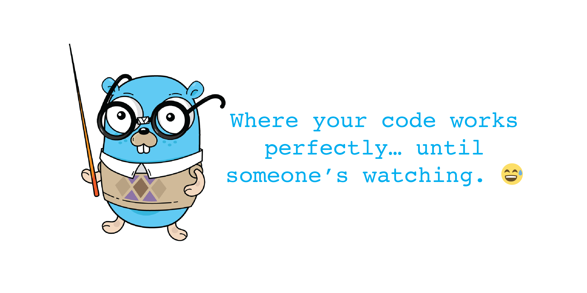

# Awesome GoLand

> /* A curated guide to the best tips and tricks for mastering GoLand. */

## Overview

Welcome to **Awesome GoLand**, a curated repository showcasing powerful features, tips, and tricks for mastering GoLand. This project contains demonstration materials and sample code for various Go development scenarios, ranging from basic debugging to advanced cloud-native workflows.

## 🚀 Featured Modules

Each module is designed to demonstrate specific GoLand capabilities. Look for `DEMO.md` or `README.md` in each directory for detailed walkthroughs.

### 🛠 Core Development
- **[Debugging](./features/debugging)**: Master the debugger with [Smart Step Into](./features/debugging/smart_step), [Goroutine Labeling](./features/debugging/label_goroutines), and [Core Dumps](./features/debugging/dump_goroutines).
- **[Testing](./features/testing/automate)**: Streamline your testing workflow with automated test generation and execution. [View Demo](./features/testing/automate/DEMO.md).
- **[JSON to Struct](./features/json-to-struct)**: Effortlessly convert JSON data into Go structs.
- **[Resource Leak Detection](./features/resource_leak_detection)**: Detect and fix resource leaks early in the development cycle. [View Demo](./features/resource_leak_detection/DEMO.md).
- **[Structural Search & Replace](./features/structural_search)**: Powerfully refactor code using pattern-based search. [Watch Video](./features/structural_search/structural_search.mp4).

### 🌐 API & Microservices
- **[gRPC CRUD](./features/go-grpc-crud)**: A complete gRPC service implementation with Create, Read, Update, and Delete operations. [Read More](./features/go-grpc-crud/README.md).
- **[Endpoint Discovery](./features/smarter_endpoint_discovery)**: Use the Endpoints tool window to discover and test your REST APIs. [View Demo](./features/smarter_endpoint_discovery/DEMO.md).

### 🐳 Docker & Kubernetes
- **[Docker Targets](./features/docker/targets/basic_rest_sqlite)**: Learn how to run and debug Go applications inside Docker containers. [View Demo](./features/docker/targets/basic_rest_sqlite/DEMO.md).
- **[Kubernetes](./features/kubernetes)**: Orchestrate your Go services with Kubernetes integration. [View Walkthrough](./features/kubernetes/DEMO.md).

### 📈 Profiling & Performance
- **[Profilers](./features/profilers)**: Analyze CPU, Memory, and Block profiles to optimize your Go code performance.

### 🤖 AI & Extensibility
- **[Junie](./features/junie)**: Explore AI-assisted development workflows. [View Demo](./features/junie/DEMO.md).
- **[MCP (Model Context Protocol)](./features/mcp)**: Enhancing LLM interactions within the IDE. [View Demo](./features/mcp/DEMO.md).

## 🏁 How to Use

1. **Explore Modules**: Navigate to any directory in `features/` to see specific examples.
2. **Follow Demos**: Most modules include a `DEMO.md` file with step-by-step instructions.
3. **Run Code**: Use GoLand's gutter icons (run/debug) to execute the `main.go` or `*_test.go` files.

---

### JetBrains Guide

You can also check out the [JetBrains Guide](https://www.jetbrains.com/guide/go/) for more in-depth knowledge about GoLand.

---

*This repository is maintained for demonstration purposes in Go-related conferences and workshops.*

