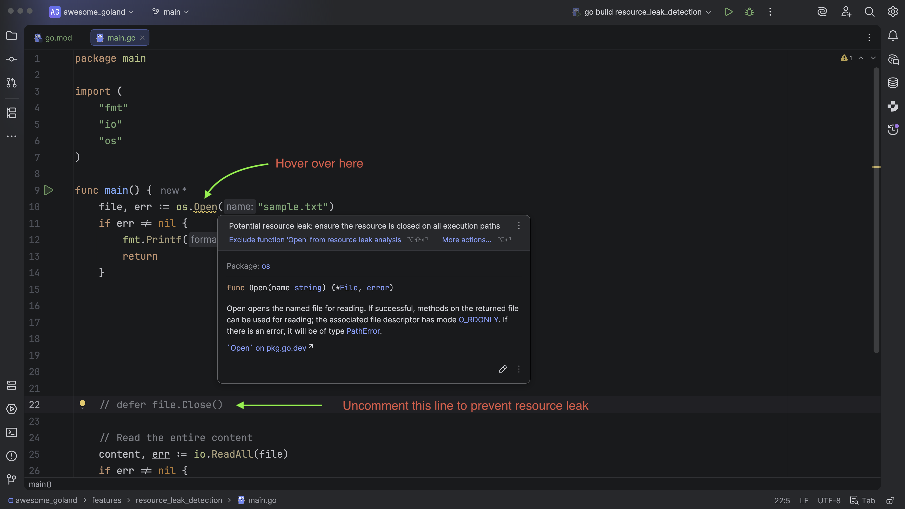

# Demo Walkthrough

### Resource Leak Detection

- Open `main.go` and hover over `os.Open`.

Read More:
- [Preventing Resource Leaks in Go: How GoLand Helps You Write Safer Code
  ](https://blog.jetbrains.com/go/2025/12/09/preventing-resource-leaks-in-go-how-goland-helps-you-write-safer-code/)

