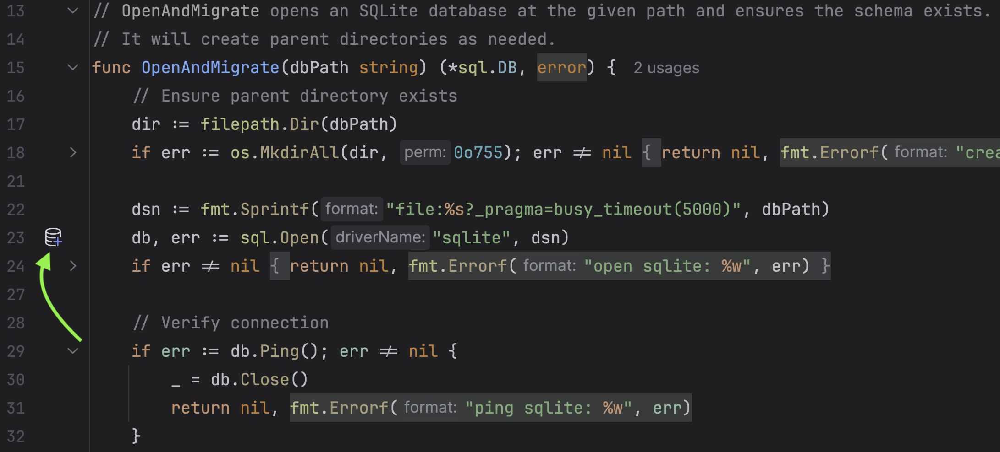
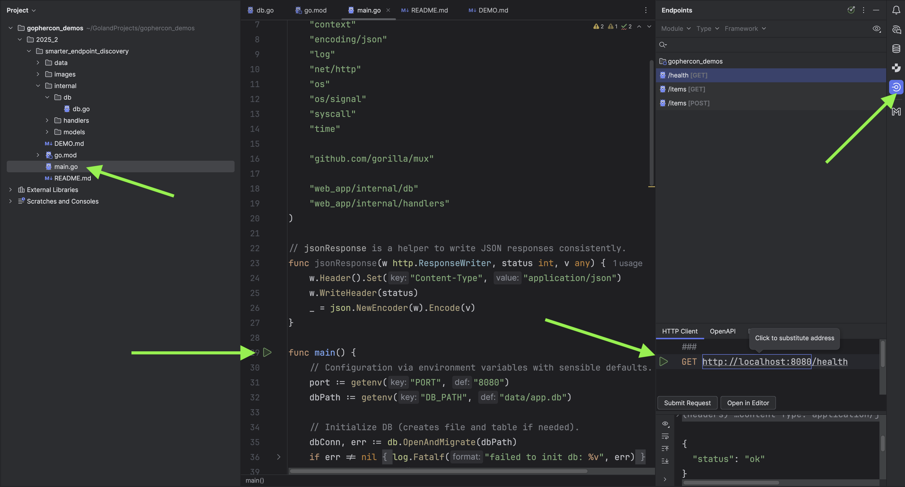

# Demo Walkthrough

### DB Icon 

Smart hints to notify the user to establish db connection directly from the codebase. 

Go to `smarter_endpoint_discovery` > `internal` > `db` > `db.go`

### Endpoint Discovery

- First open `main.go` and run the application
- Open `Endpoints` on the right
- Execute the HTTP request

