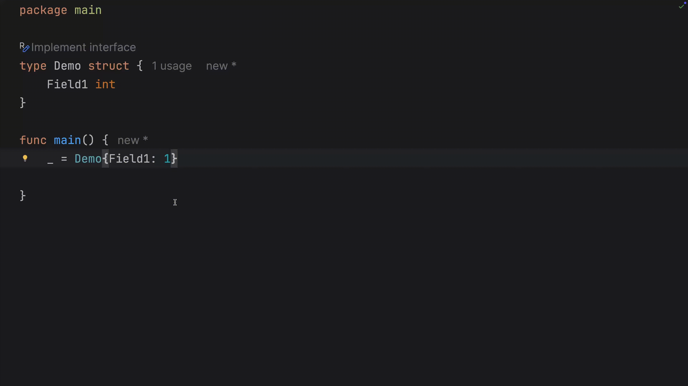

# Demo Walkthrough

### Adding Fields to a Struct

Place your cursor on a missing field, press <kbd>⌥⏎</kbd> (macOS) or <kbd>Alt+Enter</kbd> (Windows/Linux), and allow the IDE to automatically generate the corresponding field in the structure definition.
