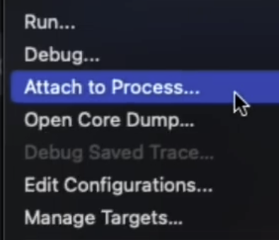

# Demo Walkthrough

### Attach the Debugger to a Running Go Processes

You can debug an application that you launched from the command line. In this case, the application runs outside the IDE but on the same local machine. To debug the application, you need to open the project in the IDE and attach the debugger to the running process.

<em>The following content is directly taken from the JetBrains Guide.</em>
