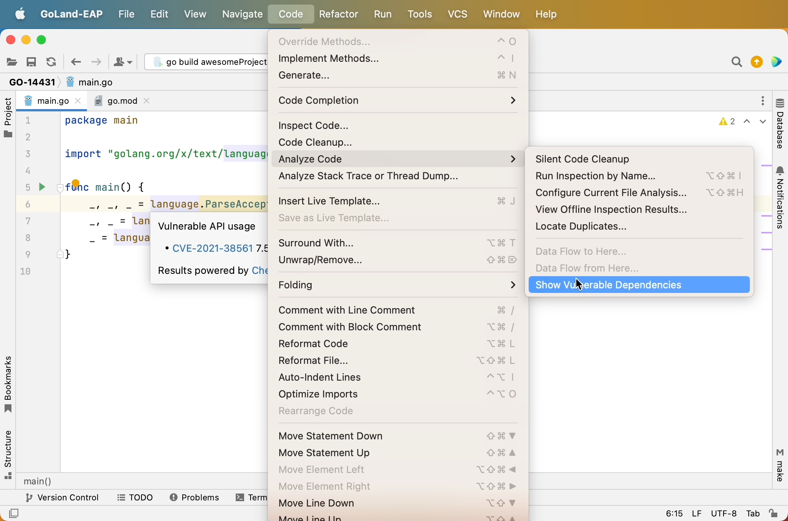

# Demo Walkthrough

### Check for Vulnerabilities

Along with packages that have vulnerabilities in _go.mod_, GoLand highlights method calls from packages with known vulnerabilities right in your editor.

To check your code for known vulnerabilities, in the main menu click **Code | Analyze Code | Show Vulnerable Dependencies**.
