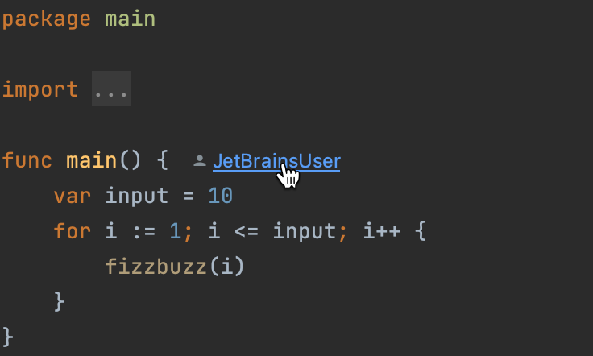

# Demo Walkthrough

### Code vision

GoLand displays the code authors if version control integration is enabled. If you click a code author’s name, the **Annotate with Git blame** sidebar opens, letting you see who introduced what changes.
