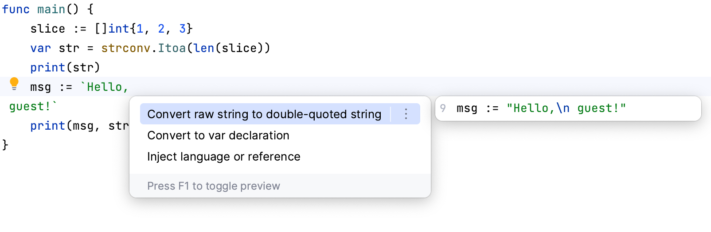

# Demo Walkthrough

### Convert Between Different Types of Strings

You can quickly convert strings that are surrounded by backticks to double-quoted ones, and vice versa.

Place the cursor on a string value, press <kbd>⌥⏎</kbd> (macOS) / <kbd>Alt+Enter</kbd> (Windows/Linux), and select **Convert double-quoted string to raw string**.

<em>The following content is directly taken from the JetBrains Guide.</em>
