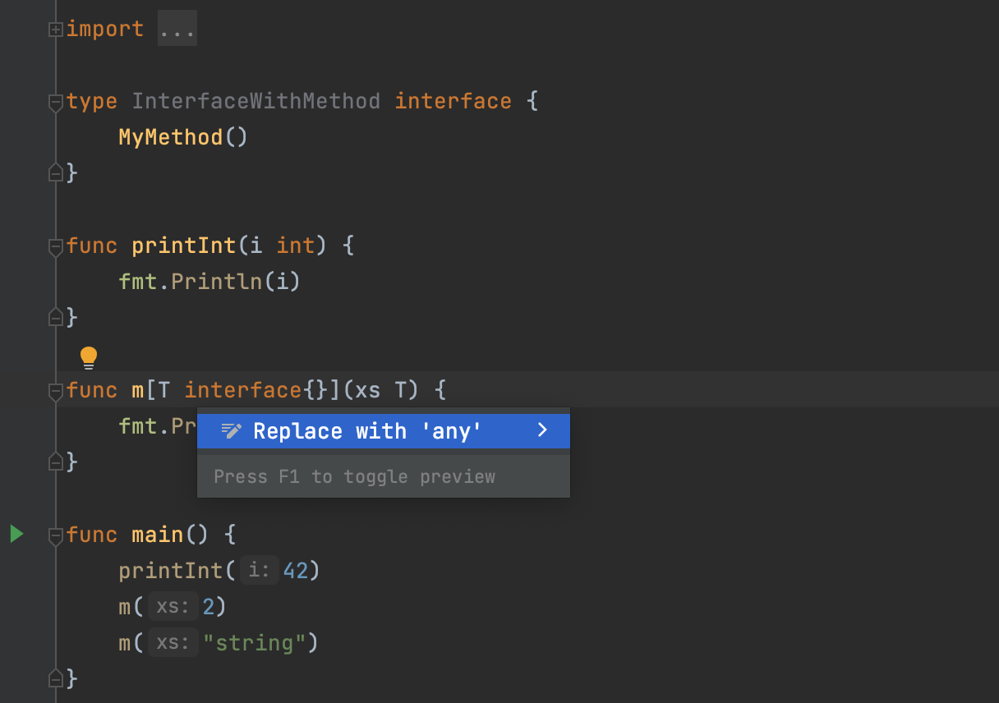

# Demo Walkthrough

### Convert Empty Interfaces to `any`

GoLand has an inspection that reports usages of empty interfaces used as a type or a type constraint. To fix such usages, try the **Replace with 'any'** intention action.

**How to use:**
Place the cursor on an empty interface, press <kbd>⌥⏎</kbd> (macOS) / <kbd>Alt+Enter</kbd> (Windows/Linux), and select **Replace with 'any'**.
