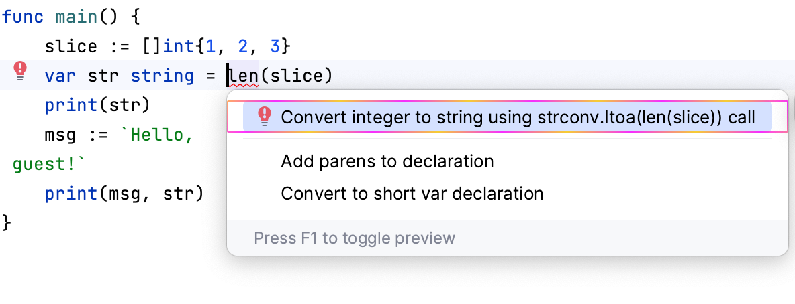

# Demo Walkthrough

### Intention Action to Convert Integers to Strings

To convert an integer to a string by using the `strconv.Itoa()` call, click the value, press <kbd>⌥⏎</kbd> (macOS) / <kbd>Alt+Enter</kbd> (Windows/Linux), and select _Convert integer to string using `strconv.Itoa()` call_.

<em>The following content is directly taken from the JetBrains Guide.</em>
