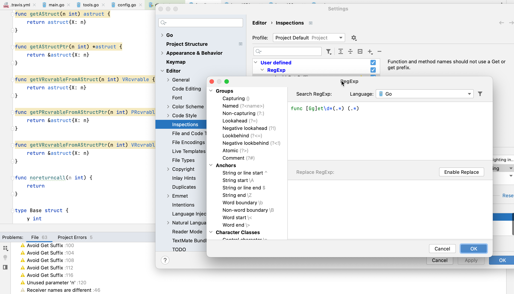

# Demo Walkthrough

### Create Inspections with Regular Expressions

Open settings, go to _Editor | Inspections_, and press **Add**. Select **Add RegExp Search Inspection…** from the list and you will be directed to a dialog where you can set up your new inspection. Select the desired language, use hints from the panel on the left to build a RegExp, and designate the required replacement. You can also specify the severity of how the IDE should highlight found cases in the project.

<em>The following content is directly taken from the JetBrains Guide.</em>
