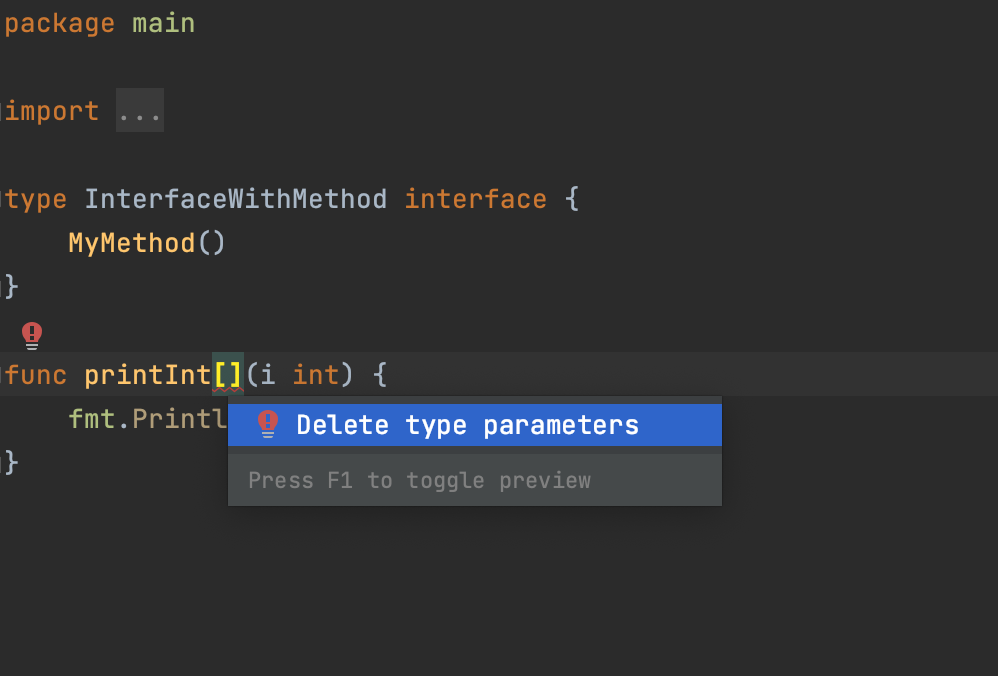

# Demo Walkthrough

### Delete a Type Parameter with an Empty Parameter List

Type parameters with empty parameter lists are highlighted as errors. So, if you type _func printInt_, GoLand will highlight _[]_ because the IDE expects type parameters here. In this case, you can either implement type parameters or delete square brackets. To delete square brackets, try the **Delete type parameters** quick-fix.

Place the cursor on the empty parameter list (_[]_), press <kbd>⌥⏎</kbd> (macOS) / <kbd>Alt+Enter</kbd> (Windows/Linux), and select **Delete type parameters**.

<em>The following content is directly taken from the JetBrains Guide.</em>
