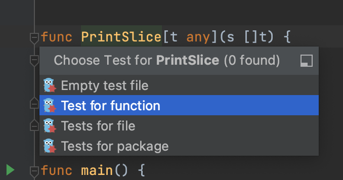

# Demo Walkthrough

### Generate Tests for Generic Functions

You can now generate tests for functions with generic parameters.

To generate a test for a generic function, click the function, press <kbd>⌘⇧T</kbd> (macOS) / <kbd>Ctrl+Shift+T</kbd> (Windows/Linux), and select **Test for function** from the popup.

<em>The following content is directly taken from the JetBrains Guide.</em>
