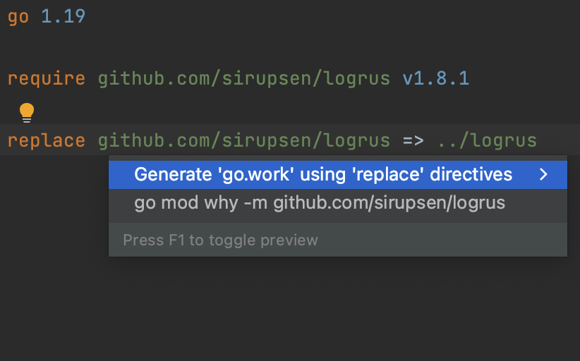

# Demo Walkthrough

### Generate 'go.work' for a Project

Right-click the root folder of your project and navigate to **New | Go Workspace File**. When you select it, a _go.work_ file will appear in your root folder. Existing Go modules will automatically be added to the _go.work_ file.

Also, you can generate _go.work_ from _go.mod_ if you have _replace_ directives there. Place the caret on a _replace_ directive, press <kbd>⌥⏎</kbd> (macOS) / <kbd>Alt+Enter</kbd> (Windows/Linux) to see all available intention actions, and select the **Generate ‘go.work’ using ‘replace’ directives** quick-fix.
