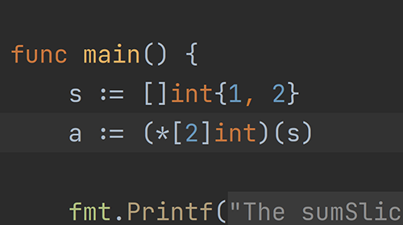

# Demo Walkthrough

### Convert Slice to Array Pointer

Optimize your code by removing bounds checks when using slices and arrays.

Go 1.17 brings a new language change: Converting a slice to an array pointer yields a pointer to the underlying array of the slice. If the length of the slice is less than the length of the array, a run-time panic occurs.

<em>The following content is directly taken from the JetBrains Guide.</em>
