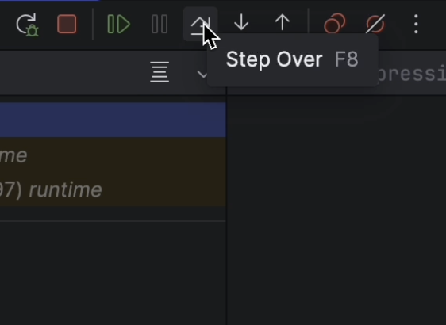

# Demo Walkthrough

### Goroutines Profiler Labels

Goroutines are integral to nearly all Go programs. However, employing numerous goroutines can complicate debugging efforts.

Starting from Go 1.9, you have the ability to capture extra information to understand the execution flow. This includes recording any labels you choose as part of profiling data, which can be later be utilized to analyze profiler outputs effectively.

<em>The following content is directly taken from the JetBrains Guide.</em>
