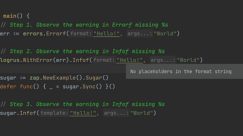

# Demo Walkthrough

### Detect Incorrect Usages

You don't need to do anything particular to use this feature. When using any output formatting function which is similar to _fmt.Printf/fmt.Println_ from a package such as _pkg/errors_, _logrus_, or _zap_. A small list of these functions are: _errors.Errorf()_, or _logrus.WithError().Infof()_.

<em>The following content is directly taken from the JetBrains Guide.</em>
