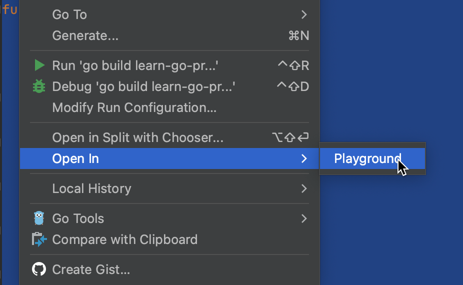

# Demo Walkthrough

### Integrated Go Playground

You can select a piece of code, choose the **Open in** option, and then click **Playground**. This will open a scratch file with a toolbar that contains the same options you have when using the Go Playground.

You can format and share your code, change the Go version, run your code using the Go playground server, or run it locally.

<em>The following content is directly taken from the JetBrains Guide.</em>
