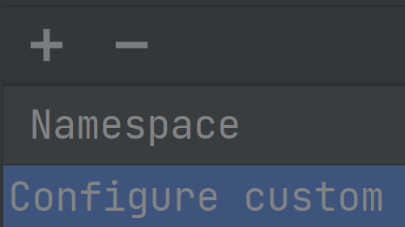

# Demo Walkthrough

### Configure Custom Namespaces Manually

If you don't have access to namespace resources due to the role-based access control, you can set up your custom namespace in **Settings |Build, Execution, Deployment | Kubernetes | Namespaces**.
