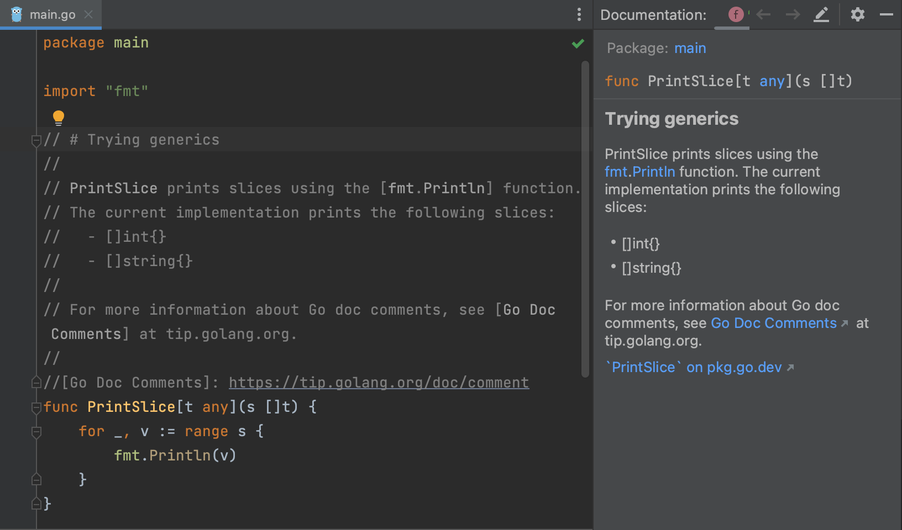

# Demo Walkthrough

### Go Doc Comments in Quick Documentation

Go 1.19 has added support for links, lists, and new headings in doc comments. Now GoLand also supports these new features.

Clicking on doc links leads to the referenced element while clicking on a text link leads to a text-link definition.

Both text and doc links are rendered as links in the _Quick Documentation_ popup and the _Documentation_ tool window.

Headings (#) and lists (\*, +, 1.) are also supported.

To see documentation about an element in your code, hover the mouse over the element or click it and press <kbd>F1</kbd> (macOS) / <kbd>Ctrl+Q</kbd> (Windows/Linux). To open documentation in the _Documentation_ tool window, press <kbd>F1</kbd> (macOS) / <kbd>Ctrl+Q</kbd> (Windows/Linux) twice.
