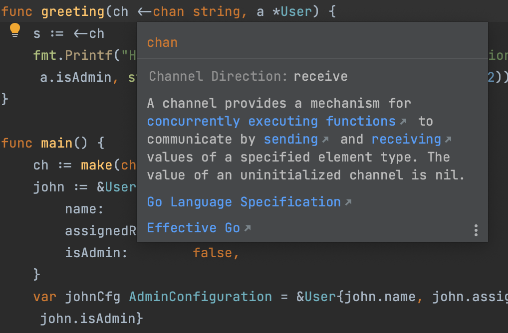

# Demo Walkthrough

### Quick Documentation

You can get quick information for any symbol right from the editor by means of the _Quick Documentation_ feature. It shows you code documentation in a popup as you hover the mouse over code elements or use a corresponding shortcut.

To see documentation about an element in your code, hover the mouse over the element, or click it and press <kbd>F1</kbd> (macOS) / <kbd>Ctrl+Q</kbd> (Windows/Linux).
