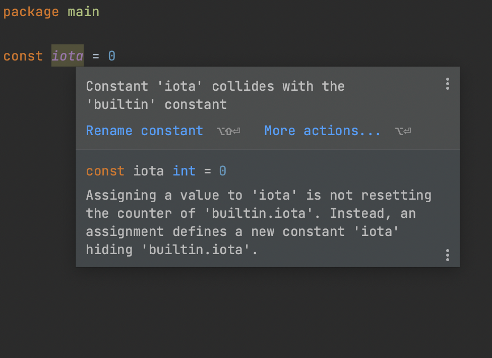

# Demo Walkthrough

### Rename Constants That Use Reserved Names

The inspection will be triggered if you try to assign a value to a constant with one of the following names: `iota`, `true`, or `false`. GoLand will suggest you to rename such usages.

Place the cursor on a highlighted constant name, press <kbd>⌘⌥⏎</kbd> (macOS) / <kbd>Ctrl+Alt+Enter</kbd> (Windows/Linux), and select **Rename constant**. Type a new name and press <kbd>⏎</kbd> (macOS) / <kbd>Enter</kbd> (Windows/Linux).
