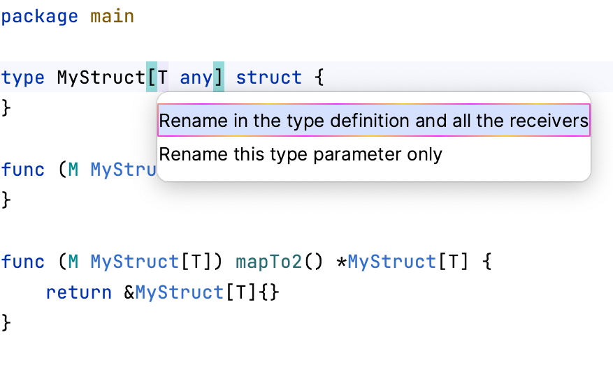

# Demo Walkthrough

### Rename Generic Receivers Along with a Generic Struct

When you rename a generic struct by pressing <kbd>⇧F6</kbd> (macOS) / <kbd>Shift+F6</kbd> (Windows/Linux), the **Rename** refactoring suggests changing the receivers accordingly.

<em>The following content is directly taken from the JetBrains Guide.</em>
