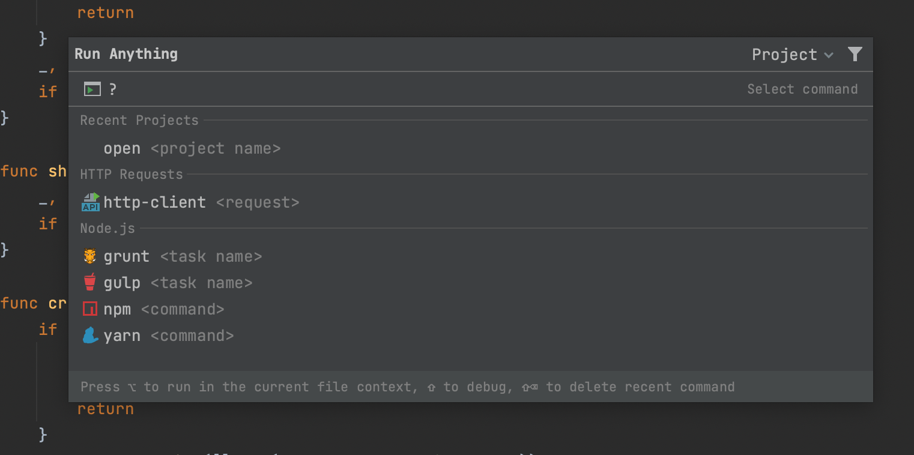

# Demo Walkthrough

### Run Anything

Run Anything is a quick way to launch run/debug configurations, applications, scripts, commands, tasks, and open recent projects.

To open the _Run Anything_ dialog, use <kbd>⌃⌃</kbd> (macOS) / <kbd>Ctrl+Ctrl</kbd> (Windows/Linux). You can type _?_ to see the options available to you and then run HTTP requests, yarn, npm, and grunt tasks.

<em>The following content is directly taken from the JetBrains Guide.</em>
