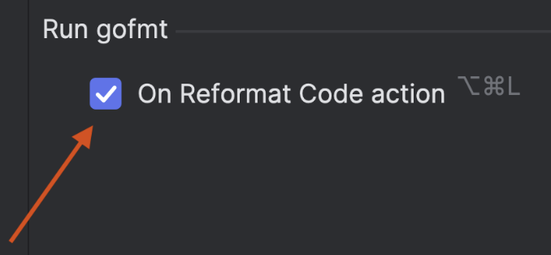

# Demo Walkthrough

### Run gofmt After the Builtin Formatter

To use this feature, check the _On code reformat_ option under **Settings/Preferences | Editor | Code Style | Go | Other**.

Now you can use the default shortcut, <kbd>⌘⌥L</kbd> (macOS) / <kbd>Ctrl+Alt+L</kbd> (Windows/Linux), to trigger the builtin formatter.

You can also search for **Run gofmt** in the IDE **Settings/Preferences**, and activate the option as described above.
