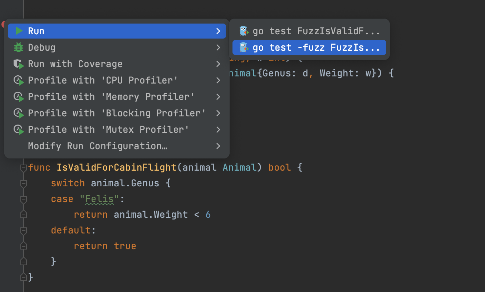

# Demo Walkthrough

### Fuzz testing

Fuzz testing allows you to check your code against the various generated data. If fuzz testing fails, you can always see the reason in the _testdata_ directory.

In the `\_test` file, click the **Run Test** icon in the gutter and navigate to **Run | go test -fuzz FuzzMyTest**.
