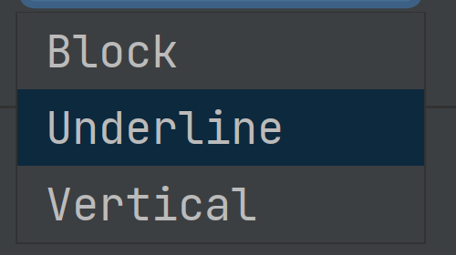

# Demo Walkthrough

### Select the Builtin Terminal Cursor Shape

Select the desired shape between _Block_, _Underline_, and _Vertical_ under **Settings/Preferences | Tools | Terminal | Cursor shape**.
