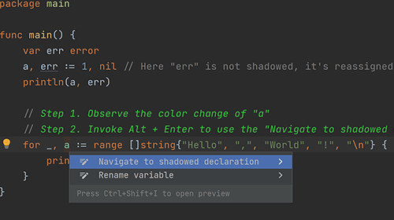

# Demo Walkthrough

### Detect Variable Shadowing While Writing Go Code

While writing code, observe if the variable color changes. If it does, then invoke the _Context Actions_ menu via <kbd>⌘⌥⏎</kbd> (macOS) / <kbd>Ctrl+Alt+Enter</kbd> (Windows/Linux) and select **Navigate to shadowed declaration** to identify the originally shadowed identifier.

<em>The following content is directly taken from the JetBrains Guide.</em>
