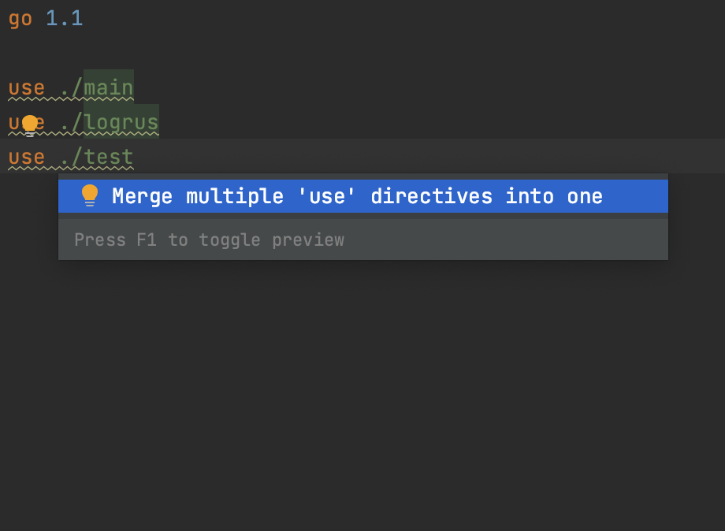

# Demo Walkthrough

### Group Multiple `use` Directives in `go.work`

If you have multiple `use` directives in your `go.work` file, you can merge them in a single one with a quick-fix.

Place the cursor on a `use` directive, press <kbd>⌥⏎</kbd> (macOS) / <kbd>Alt+Enter</kbd> (Windows/Linux), and select _Merge multiple use directives into one_.
